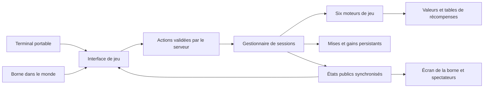

# Gambling Items — proposition de conception

Statut : mécaniques proposées ; sur Fabric 1.21.1, l'Upgrader, le Trade Up, les caisses, le Crash et la roulette sont implémentés et testés. Les battles restent à développer.

## Objectif

Créer un mod Minecraft Java réunissant six jeux autour des objets du jeu : Upgrader, Crash, Trade Up, ouverture de caisses, roulette et battles de caisses multijoueurs.

Le joueur dispose de deux accès au même système :

- Un terminal portable, utilisé au clic droit, ouvre une interface personnelle.
- Une borne posée dans le monde ouvre l'interface et permet de rejoindre une session partagée. Son écran affiche la partie aux joueurs proches, même lorsqu'ils n'ont pas le menu ouvert.

Les gains et les mises utilisent exclusivement des objets Minecraft dans le périmètre proposé. Les valeurs internes servent à comparer les objets, pas à créer obligatoirement une monnaie supplémentaire.

Cible initiale confirmée : **Minecraft 1.21.1, Fabric, Java 21**. Préparer les futurs portages vers **Minecraft 26.2** et **NeoForge** sans les annoncer compatibles avant implémentation et validation.

Le cœur Java ne dépend ni de Minecraft ni d'un chargeur. Les intégrations Minecraft sont séparées par version et chargeur, avec des compilations indépendantes. Voir [ARCHITECTURE.md](ARCHITECTURE.md) pour les frontières et la stratégie de portage.

## Expérience commune

Le terminal présente six onglets. Chaque jeu affiche avant engagement la mise, les règles, les récompenses possibles et les probabilités connues. Un espace « Gains à récupérer » reçoit les récompenses en attente.

Un objet déposé dans une interface reste récupérable tant que la mise n'est pas confirmée. Le bouton de lancement affiche le coût exact. Après validation serveur, la mise est engagée et la fermeture du menu n'annule pas le jeu.

Le terminal portable ouvre une session privée pour les jeux individuels. Pour Crash, roulette partagée et battles, il peut rejoindre une session publique annoncée par une borne. Il ne crée pas implicitement une nouvelle partie lorsque le joueur rouvre son interface.

Les interfaces restent utilisables aux différentes échelles de GUI Minecraft. Prévoir des textes français et anglais, des infobulles, une recherche d'objets et une option pour réduire les animations.

## 1. Upgrader

Le joueur dépose un objet ou une pile, puis choisit une récompense dans un catalogue filtrable. L'écran présente la valeur déposée, la valeur du gain, les chances et une roue animée.

Proposition de règle :

```text
Ventrée = valeur totale de la mise
Vsortie = valeur totale de la récompense choisie
p = min(pMaximum, rendement × Ventrée / Vsortie)
```

Les réglages initiaux peuvent être `rendement = 0,90` et `pMaximum = 0,90`. Ce sont des paramètres d'équilibrage proposés, pas des valeurs définitives.

Pour un véritable upgrade, seules les récompenses plus chères que la mise sont proposées. Un seuil minimal de probabilité peut masquer les cibles trop lointaines, mais ne doit pas augmenter artificiellement leur chance.

Exemple : une mise de valeur 10 visant une récompense de valeur 25 donne 36 % de réussite avec ces réglages. Un succès délivre la récompense ; un échec consomme la mise.

Le serveur décide du résultat. L'animation termine sur ce résultat et ne détermine jamais le gain. Ne pas transférer automatiquement les enchantements de l'objet sacrifié vers une récompense standard.

## 2. Crash

Une borne héberge une manche commune : inscriptions, vol, crash, résultats. Chaque participant mise séparément et peut encaisser indépendamment des autres.

Le multiplicateur démarre à 1× et augmente jusqu'au crash. Un retrait validé avant le crash rapporte `mise × multiplicateur` ; une mise encore engagée au crash est perdue.

Pour la première implémentation, utiliser une seule matière par table : diamant, émeraude, or ou autre objet configuré. Une mise de 5 diamants encaissée à 2,4× rapporte 12 diamants au total, mise comprise. Aucune mise maximale n'est fixée : une mise est refusée seulement si son gain le plus élevé ne tiendrait pas dans les gains à récupérer du joueur. Le total versé est arrondi vers le bas ; afficher cette règle. Éviter de mélanger directement outils et minerais dans un paiement fractionnaire.

Retenu à l'implémentation : pas de retrait automatique. Un retrait est toujours une action du joueur pendant le vol ; une déconnexion ne retire ni ne rembourse la mise.

Le serveur utilise ses ticks pour le vol. Tous voient le même multiplicateur et le même crash. Un retrait reçu au tick du crash est refusé : cette priorité doit être constante, documentée et testée. L'instant d'un clic côté client n'est pas une preuve d'antériorité.

La distribution du crash, le multiplicateur maximal et le rendement doivent être configurables et vérifiés ensemble. Ne pas choisir le crash uniformément entre deux multiplicateurs : cela ne contrôle pas correctement le rendement à chaque seuil de retrait.

## 3. Trade Up

Le joueur échange plusieurs objets de valeur comparable contre un seul objet aléatoire plus précieux individuellement.

Proposition initiale : cinq unités admissibles, avec un rapport maximal de 1,25 entre la valeur unitaire la plus élevée et la plus basse. Compter les unités, pas seulement les cases occupées. Les outils endommagés sont comparés à leur valeur effective.

Les sorties admissibles doivent avoir une valeur strictement supérieure à celle du meilleur objet d'entrée. Leur valeur peut rester inférieure à la somme des entrées.

Exemple : cinq objets de valeur 10 sont consommés. Une table peut proposer :

| Valeur du gain | Probabilité proposée |
| --- | --- |
| 20 | 60 % |
| 45 | 30 % |
| 100 | 10 % |

Chaque résultat vaut plus qu'un objet d'entrée. La valeur moyenne du gain est 35,5 pour une mise totale de 50. Cet exemple illustre la mécanique ; les poids définitifs seront équilibrés avec le catalogue réel.

Afficher les sorties et leurs chances avant confirmation. Refuser une combinaison sans sortie admissible sans consommer les objets. Prévoir des contrats par famille ou palier pour éviter qu'une table générique donne des récompenses incohérentes.

## 4. Caisses

Chaque type de caisse possède un nom, une apparence, un prix et une table de récompenses pondérées. Le prix est exprimé en diamant ou dans un objet configuré ; afficher l'identité et la quantité requises.

La table définit précisément l'objet, la quantité, les éventuelles données et le poids de chaque gain. Une rareté est une catégorie d'affichage, pas une valeur économique automatique. Calculer la probabilité effective à partir des poids et l'afficher.

Après paiement, un ruban d'objets défile, ralentit et s'arrête sur le gain. Le gain est déterminé et enregistré par le serveur avant le défilement. Fermer l'écran, quitter le serveur ou réduire l'animation ne permet pas de relancer le tirage.

Les caisses sont configurables. Les données d'une ouverture en cours sont figées pour qu'une modification de configuration ne change pas son prix ni son résultat.

## 5. Roulette

Retenu à l'implémentation : la roulette courte à 15 cases, avec 7 rouges, 7 noires et 1 verte. La roue complète à numéros reste une évolution possible.

Les paris rouge et noir versent 2× la mise, et le vert verse 14×. Ces multiplicateurs incluent la mise initiale. Sur des cases équiprobables, les trois paris ont un retour moyen de 14/15, soit environ 93,33 %, avant tout autre ajustement.

Une roue numérotée de 0 à 36 est une autre option si l'on veut les paris plein, pair/impair, douzaines et colonnes. Ce choix change sensiblement le GUI et le nombre de règles à implémenter.

La borne propose des manches synchronisées : prise des paris, verrouillage, rotation, paiement. Les joueurs voient le résultat commun et un historique limité. Les paris n'acceptent plus de changement une fois verrouillés.

## 6. Battles de caisses

Proposition initiale : deux à quatre joueurs, une liste identique de caisses à ouvrir et un nombre de manches fixé à la création du salon.

Avant inscription, afficher le coût total par joueur, la liste des caisses, le mode de victoire et les règles d'égalité. Chaque participant paie son entrée, qui reste réservée jusqu'au lancement. Un départ avant lancement ou l'expiration du salon restitue cette entrée une seule fois.

Lorsque tous sont prêts et financés, le serveur verrouille le salon. À chaque manche, chaque joueur reçoit un tirage indépendant de la même caisse. Les animations sont synchronisées et les spectateurs peuvent suivre les résultats.

Le score correspond à la somme des valeurs des objets tirés, figées au lancement de la battle. Le joueur au meilleur score remporte tous les objets tirés. En cas d'égalité, une règle initiale simple est un tirage uniforme entre les joueurs ex æquo, annoncé avant l'entrée.

Après lancement, la partie continue même si un participant se déconnecte. Les gains vont au compte de récupération du gagnant. Les objets montrés pendant les manches ne sont pas distribués immédiatement aux participants, ce qui évite un double paiement.

Les équipes 2v2, parties privées par code et modes de victoire alternatifs peuvent être ajoutés ensuite. Ils ne font pas partie de cette proposition initiale.

## Valeur des objets

Tous les jeux utilisent un service de valorisation commun. L'ordre de priorité proposé est :

1. Valeur explicite configurée par l'administrateur pour un objet ou une variante prise en charge.
2. Calcul depuis les recettes prises en charge, à partir de matières de base valorisées.
3. Objet indisponible tant qu'aucune estimation valide n'est possible.

Pour les recettes, tenir compte du nombre d'objets produits, des ingrédients alternatifs, des récipients restitués et des cycles de conversion. Un calcul naïf fer/bloc de fer se boucle ; il faut détecter les cycles et ancrer le calcul dans les valeurs explicites.

La valeur calculée reflète un coût conventionnel, pas automatiquement la rareté ni le temps nécessaire à une ferme. Les administrateurs doivent pouvoir la corriger. Les recettes de mods ne sont compatibles que si leur format est effectivement pris en charge.

Pour les objets endommagés, appliquer un coefficient lié à la durabilité restante. Les enchantements et autres données nécessitent des règles explicites. Au départ, exclure les objets contenant un inventaire, les variantes non valorisables et les objets techniques. Ne pas remplacer silencieusement un objet avec données par sa variante vierge.

Calculer les valeurs avec une précision fixe et des limites de quantité. Contrôler les dépassements numériques et les poids invalides. Une session conserve sa version du catalogue, de ses probabilités et de ses prix jusqu'à son règlement.

## Architecture proposée



Le code client dessine les écrans, les objets et les animations. Le serveur valide les actions, possède les mises, effectue les tirages et règle les gains. Une intention envoyée par le client ne contient jamais un gain ou une probabilité à accepter sans recalcul.

Les bornes conservent leur identité, leur configuration et une référence de session. Les parties actives sont gérées au niveau du serveur : décharger le chunk de la borne ne doit pas suspendre un Crash ou dupliquer une battle.

Séparer les modules : valorisation, tables de récompenses, transactions, sessions, moteurs de jeu, réseau, inventaires, interfaces et rendu dans le monde. L'objet portable et la borne appellent les mêmes moteurs.

## Fiabilité multijoueur

- Valider la session, le joueur, la phase, les quantités et les droits d'accès pour chaque action. Limiter la fréquence des requêtes.
- Empêcher qu'une même mise alimente deux jeux. Les objets engagés appartiennent à la transaction, pas à un emplacement de GUI réutilisable.
- Associer un identifiant unique à chaque opération et ignorer une demande déjà réglée. Un double clic ou une répétition de paquet ne doit pas repayer le gain.
- Stocker les récompenses non réclamées par identifiant de joueur. Si son inventaire est plein, elles restent récupérables.
- Sauvegarder les mises, phases et gains. Pour un arrêt brutal, prévoir un journal et une procédure de reprise conciliant l'état de transaction avec l'inventaire persistant ; une simple sauvegarde de bloc ne garantit pas l'absence de duplication.
- Pour la première politique de reprise : un résultat déjà fixé reste fixé ; une manche temporelle interrompue sans règlement est annulée avec restitution unique des mises non réglées. Les retraits déjà réglés ne sont pas remboursés à nouveau.
- La destruction d'une borne ne libère pas directement les mises dans le monde. Une manche engagée continue côté serveur ; les gains et remboursements restent récupérables.
- Ne synchroniser que l'état public et les données privées du joueur concerné. Le seuil de crash reste secret jusqu'au crash.

## Ordre de réalisation proposé

1. Cible fixée : Fabric 1.21.1. Préciser les décisions de gameplay encore ouvertes ; conserver des frontières adaptées aux futurs portages.
2. Construire le socle : projet compilable, valeurs configurées, terminal portable, borne, inventaires, réseau et récupération des gains.
3. Livrer l'Upgrader complet avec une première interface et une animation ; vérifier le flux entier en solo et à deux sur serveur dédié.
4. Ajouter le Trade Up et les caisses, avec configuration des tables et animations.
5. Ajouter les manches partagées de Crash et de roulette, puis l'affichage de la borne dans le monde.
6. Ajouter les salons de battle, les manches synchronisées et le règlement commun.
7. Étendre la valorisation aux recettes et objets de mods explicitement testés, puis équilibrer les tables et finaliser les visuels.

Tous les six modes appartiennent à l'objectif final. Cet ordre découpe les dépendances, sans prétendre qu'une première version avec un seul mode est le mod terminé.

## Vérifications avant de qualifier une version de jouable

Vérifier les formules et tables avec des tests déterministes : somme des poids, limites de probabilité, sélection pondérée, arrondis, contrats impossibles, cycles de recettes et paiements uniques. Les simulations statistiques aident à équilibrer mais ne remplacent pas ces tests.

Sur serveur dédié avec deux clients, tester les dépôts concurrents, doubles clics, fermeture d'interface, déconnexion, inventaire plein, déplacement d'un objet engagé, mort, changement de dimension, destruction de borne et déchargement de chunk. Tester aussi les retraits au tick du crash, départs de salons, égalités et rechargements de configuration.

Provoquer un redémarrage aux différentes étapes du paiement pour vérifier la reprise. Un succès de compilation seul ne valide pas ces comportements.

## Décisions à confirmer

- Version à viser pour le premier portage NeoForge : 1.21.1 ou 26.2 ; à décider au moment de ce portage.
- Roulette courte rouge/noir/vert ou roulette complète à numéros.
- Trade Up à cinq unités, dix unités ou contrats configurables.
- Accès portable aux salons partagés : à proximité d'une borne ou à distance.
- Style visuel : interface proche des textures Minecraft ou terminal plus moderne.

## Références consultées

- [Upgrader items](https://modrinth.com/mod/upgrade-items) : objet ouvrant une interface, sélection de cible, roue et valorisation à partir des recettes.
- [Gambled](https://modrinth.com/mod/gambled) : machines dans le monde, Rocket/Crash et Upgrader ; sa fiche indique Fabric 1.20.1.
- [Fabric — Networking](https://docs.fabricmc.net/develop/networking) : séparation client/serveur et échanges réseau. Consulter la documentation correspondant à la version retenue lors de l'implémentation.
- [Fabric — Block Entities](https://docs.fabricmc.net/develop/blocks/block-entities) : données attachées aux blocs. La page courante n'est pas une référence d'API pour toutes les anciennes versions.
- [NeoForge 1.21.1 — Menus](https://docs.neoforged.net/docs/1.21.1/gui/menus/) : menus et synchronisation si cette cible est retenue.

La proposition décrit une implémentation originale inspirée des usages demandés.
